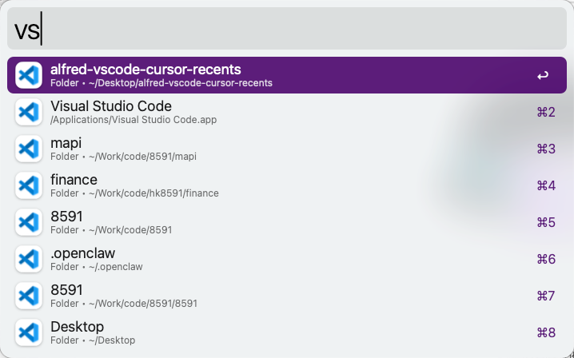
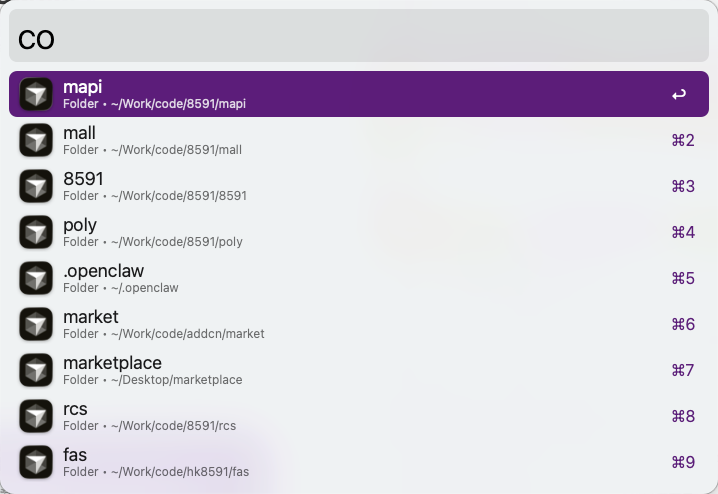

# VS Code + Cursor Recents

Open recent **VS Code** and **Cursor** projects from Alfred.

It reads each editor's native **Open Recent** cache by default, and also supports custom recent-cache locations when your local setup is non-standard.

## Requirements

- macOS
- Alfred 5
- VS Code or Cursor

## Preview

## Usage

- `vs` → search VS Code recents
- `co` → search Cursor recents
- `Enter` → open in the matching editor

## Highlights

- uses each editor's native **Open Recent** cache
- supports VS Code, VS Code Insiders, Cursor, and Cursor Insiders
- supports custom recent cache locations via configuration overrides
- does **not** scan your filesystem

## Configuration

The workflow should work out of the box on standard macOS installs.

Only change these if your editor's `storage.json` lives in a non-default location:

- `vscode_storage_paths`
- `cursor_storage_paths`
- `debug_mode`

Supported path formats:

- `:` separated paths
- one path per line

## Notes

- Only items already present in each editor's **Open Recent** menu are shown
- The workflow does **not** scan your filesystem
- `debug_mode=1` is only for troubleshooting

## License

MIT
